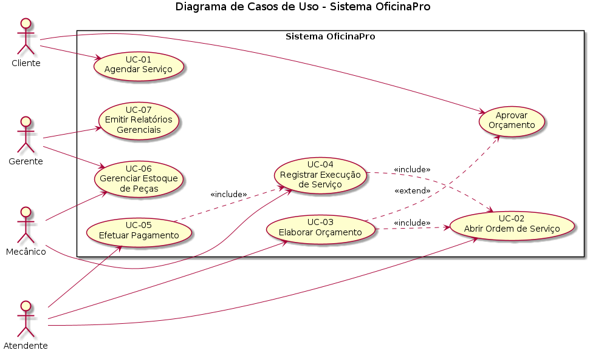
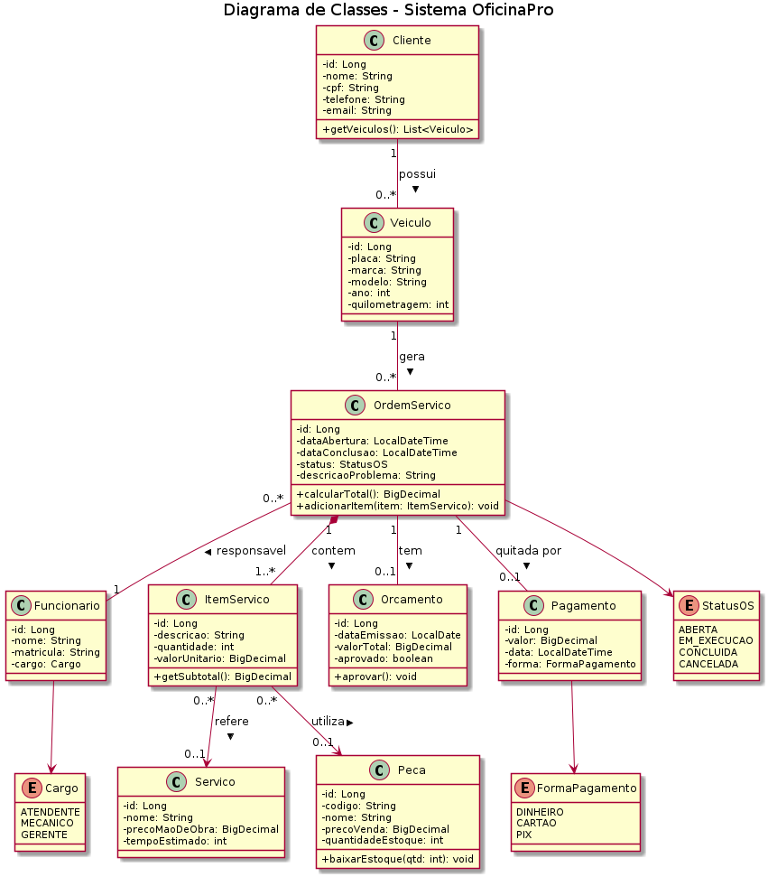
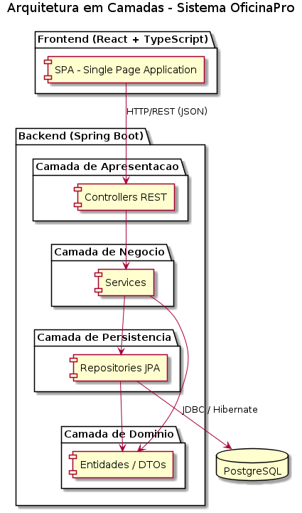
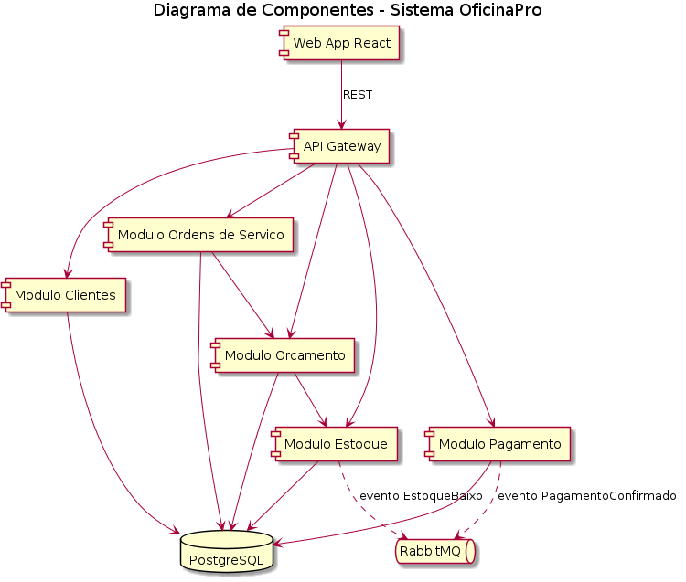
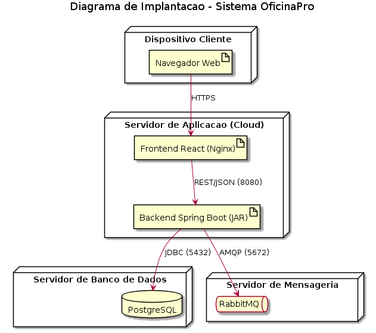
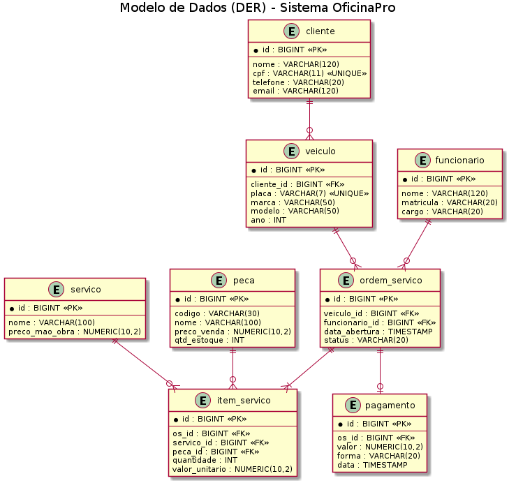
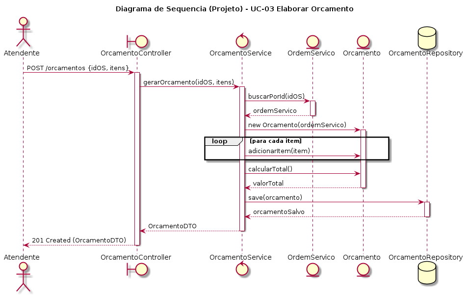
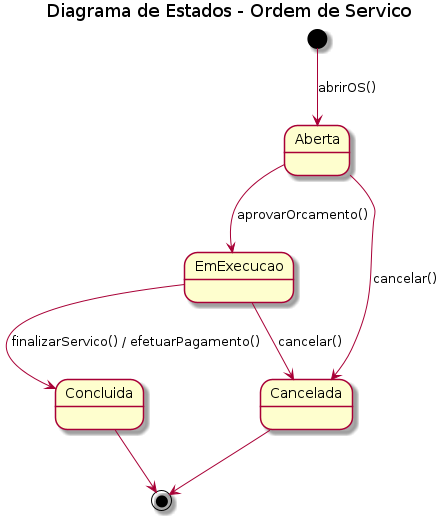

<a href="#"></a> <a href="#"></a>

---

# 🔧 OficinaPro 👨‍💻

> [!NOTE]
> Sistema web de gestão para oficinas mecânicas. **Centraliza agendamentos, ordens de serviço, orçamentos, estoque de peças e pagamentos em uma única plataforma.**

<table>
  <tr>
    <td width="800px">
      <div align="justify">
        O <b>OficinaPro</b> é uma aplicação <i>full-stack</i> projetada para oficinas mecânicas de pequeno e médio porte. Ele substitui o controle manual em papel e planilhas por um fluxo digital que acompanha o veículo desde o agendamento até o pagamento, passando pela abertura da ordem de serviço, elaboração de orçamento, execução do reparo e baixa de estoque. O objetivo é <b>reduzir perdas de informação, retrabalho e atrasos no atendimento</b>, oferecendo ainda <i>relatórios gerenciais</i> que apoiam a tomada de decisão do dono da oficina. Este repositório contém o <b>projeto, a diagramação e a arquitetura</b> da solução (UML em PlantUML), sem implementação de código.
      </div>
    </td>
    <td>
      <div>
        
      </div>
    </td>
  </tr>
</table>

---

## 🚧 Status do Projeto

[](#)       

> 🟢 **Em projeto / diagramação** — Trabalho acadêmico da disciplina **Projeto de Software** (PUC Minas).

---

## 📚 Índice
- [Links Úteis](#-links-úteis)
- [Sobre o Projeto](#-sobre-o-projeto)
- [Funcionalidades Principais](#-funcionalidades-principais)
- [Tecnologias Utilizadas](#-tecnologias-utilizadas)
- [Arquitetura](#-arquitetura)
  - [Diagramas](#diagramas)
- [Instalação e Execução](#-instalação-e-execução)
  - [Pré-requisitos](#pré-requisitos)
  - [Variáveis de Ambiente](#-variáveis-de-ambiente)
  - [Como Executar a Aplicação](#-como-executar-a-aplicação)
- [Estrutura de Pastas](#-estrutura-de-pastas)
- [Testes](#-testes)
- [Documentações utilizadas](#-documentações-utilizadas)
- [Autores](#-autores)
- [Contribuição](#-contribuição)
- [Agradecimentos](#-agradecimentos)
- [Licença](#-licença)

---

## 🔗 Links Úteis
* 🌐 **Demo Online:** [Acesse a Aplicação Web](https://oficinapro.exemplo.app)
  > 💻 **Descrição:** Aplicação em ambiente de produção (hospedada na Vercel).
* 📖 **Documentação:** [Documentação de Projeto (UML)](./docs/Documentacao_de_Projeto_OficinaPro.docx)
  > 📚 **Descrição:** Documento de projeto completo com casos de uso, contratos, diagramas e modelo de dados.
* 🧩 **Código PlantUML:** [Diagramas em PlantUML](./plantuml)
  > 🧩 **Descrição:** Fonte `.puml` de todos os diagramas UML do sistema.

---

## 📝 Sobre o Projeto

O **OficinaPro** nasceu da observação de que muitas oficinas mecânicas ainda controlam seus atendimentos em cadernos e planilhas, o que gera perda de histórico de veículos, orçamentos extraviados e dificuldade em saber o que está em estoque.

- **Por que ele existe:** digitalizar e organizar o atendimento de uma oficina, do agendamento ao pagamento.
- **Qual problema ele resolve:** falta de rastreabilidade das ordens de serviço, retrabalho em orçamentos e ruptura de estoque de peças.
- **Qual o contexto:** acadêmico — disciplina **Projeto de Software** do curso de Engenharia de Software da PUC Minas.
- **Onde pode ser utilizado:** oficinas mecânicas de pequeno e médio porte, centros automotivos e auto centers.

O valor entregue é um fluxo único e rastreável: cada veículo tem seu histórico, cada ordem de serviço tem seu orçamento e pagamento associados, e o gestor enxerga indicadores em tempo real.

> [!NOTE]
> Este projeto foca em **modelagem e arquitetura**, conforme o enunciado da disciplina. A implementação do código não faz parte do escopo.

---

## ✨ Funcionalidades Principais

- 📅 **Agendamento de Serviços:** cliente agenda atendimento informando veículo, serviço e horário.
- 🧾 **Ordens de Serviço (OS):** abertura, acompanhamento de status e histórico por veículo.
- 💰 **Orçamentos:** composição de serviços e peças com cálculo automático do total e aprovação do cliente.
- 🔩 **Controle de Estoque de Peças:** baixa automática ao usar peças e alerta de estoque baixo.
- 💳 **Pagamentos:** registro por dinheiro, cartão ou PIX, com emissão de recibo.
- 📊 **Relatórios Gerenciais:** faturamento, serviços mais executados e desempenho da equipe.
- 🔐 **Autenticação por Perfil:** acessos distintos para Cliente, Atendente, Mecânico e Gerente.
- 🔄 **Eventos Assíncronos:** notificações via mensageria (pagamento confirmado, estoque baixo).

---

## 🛠 Tecnologias Utilizadas

As ferramentas abaixo são as **previstas para a futura implementação** do projeto (informações fictícias para fins acadêmicos).

### 💻 Front-end

* **Framework/Biblioteca:** React 19
* **Linguagem/Superset:** TypeScript 5.6
* **Estilização:** Tailwind CSS 4
* **Gerenciamento de Estado:** Context API + React Query
* **Build Tool:** Vite 7

### 🖥️ Back-end

* **Linguagem/Runtime:** Java 17 (JDK)
* **Framework:** Spring Boot 3.3.5
* **Banco de Dados:** PostgreSQL 16
* **ORM / Query Builder:** Hibernate / Spring Data JPA
* **Autenticação:** Spring Security + JWT
* **Mensageria:** RabbitMQ 3.13

### ⚙️ Infraestrutura & DevOps

* **Containerização:** Docker + Docker Compose
* **Cloud:** Vercel (front-end) + Render (back-end e banco)
* **CI/CD:** GitHub Actions

---

## 🏗 Arquitetura

O OficinaPro adota uma **arquitetura em camadas** (layered architecture). O front-end React (SPA) consome uma **API REST** servida pelo back-end Spring Boot, que se organiza em camadas de **Apresentação (Controllers)**, **Negócio (Services)**, **Persistência (Repositories JPA)** e **Domínio (Entidades/DTOs)**. A persistência é feita em PostgreSQL via Hibernate.

**Padrões de projeto adotados:**

- **Controller** — pontos de entrada REST.
- **Service Layer** — regras de negócio.
- **Repository** — abstração do acesso a dados.
- **DTO** — transporte de dados entre camadas, isolando o domínio.

**Decisões e trade-offs:** a arquitetura em camadas foi escolhida pela clareza de responsabilidades e facilidade de teste. Como trade-off, pode haver mais código de transporte (DTOs e mapeadores) do que em uma abordagem mais simples. Eventos assíncronos (RabbitMQ) desacoplam notificações e reposição de estoque do fluxo principal.

### Diagramas

| Casos de Uso | Diagrama de Classes |
| :---: | :---: |
|  |  |
| **Arquitetura em Camadas** | **Diagrama de Componentes** |
|  |  |
| **Diagrama de Implantação** | **Modelo de Dados (DER)** |
|  |  |
| **Sequência (UC-03)** | **Estados da Ordem de Serviço** |
|  |  |

---

## 🔧 Instalação e Execução

### Pré-requisitos

* **Java JDK:** versão **17** ou superior (Back-end Spring Boot)
* **Node.js:** versão LTS (v18.x ou superior) (Front-end React)
* **Gerenciador de Pacotes:** npm ou yarn
* **Docker** (recomendado para o Banco de Dados e a mensageria)

---

### 🔑 Variáveis de Ambiente

#### Back-end (Spring Boot)

| Variável | Descrição | Exemplo |
| :--- | :--- | :--- |
| `SERVER_PORT` | Porta do Back-end. | `8080` |
| `SPRING_DATASOURCE_URL` | URL JDBC (PostgreSQL). | `jdbc:postgresql://localhost:5432/oficinapro` |
| `SPRING_DATASOURCE_USERNAME` | Usuário do banco. | `postgres` |
| `SPRING_DATASOURCE_PASSWORD` | Senha do banco. | `senha-segura-123` |
| `SPRING_RABBITMQ_HOST` | Host da mensageria. | `localhost` |
| `JWT_SECRET` | Chave de assinatura dos tokens. | `chave_super_segura_base64` |

#### Front-end (React, Vite)

| Variável | Descrição | Exemplo |
| :--- | :--- | :--- |
| `VITE_API_URL` | URL base da API. | `http://localhost:8080/api` |

---

### ▶ Como Executar a Aplicação

#### Terminal 1: Back-end (Spring Boot)

```bash
cd backend
./mvnw spring-boot:run
```

#### Terminal 2: Front-end (React, Vite)

```bash
cd frontend
npm install
npm run dev
```

#### Execução Local Completa com Docker Compose

```bash
docker-compose up --build
```

---

## 🗂 Estrutura de Pastas

```
.
├── README.md                    # 📘 Documentação principal do projeto.
├── LICENSE                      # ⚖️ Licença do projeto.
├── docker-compose.yml           # 🐳 Orquestração dos containers (front/back/db/mq).
│
├── /docs                        # 📚 Documentação de projeto e diagramas
│   ├── Documentacao_de_Projeto_OficinaPro.docx
│   └── /diagramas               # 🖼️ PNGs renderizados dos diagramas UML
│
├── /plantuml                    # 🧩 Código-fonte PlantUML (.puml) de todos os diagramas
│   ├── 01_casos_de_uso.puml
│   ├── 02_classes.puml
│   ├── 03_dss_uc01_agendar.puml
│   ├── 04_dss_uc03_orcamento.puml
│   ├── 05_dss_uc05_pagamento.puml
│   ├── 06_seq_uc03_detalhado.puml
│   ├── 07_comunicacao_uc05.puml
│   ├── 08_estados_os.puml
│   ├── 09_arquitetura.puml
│   ├── 10_componentes.puml
│   ├── 11_implantacao.puml
│   └── 12_modelo_dados.puml
│
├── /frontend                    # 📁 Aplicação React (estrutura prevista)
│   └── /src
│       ├── /components          # 🧱 Componentes reutilizáveis (UI).
│       ├── /pages               # 📄 Páginas/rotas da aplicação.
│       ├── /services            # 🔌 Serviços e chamadas HTTP.
│       └── /hooks               # 🎣 Hooks personalizados.
│
└── /backend                     # 📁 Aplicação Spring Boot (estrutura prevista)
    └── /src/main/java/com/oficinapro
        ├── /controller          # 🎮 Endpoints REST.
        ├── /service             # ⚙️ Regras e lógica de negócio.
        ├── /repository          # 🗄️ Repositórios (JPA/Hibernate).
        ├── /model               # 🧬 Entidades persistentes (JPA).
        ├── /dto                 # ✉️ Data Transfer Objects.
        └── /config              # 🔧 Configurações gerais.
```

---

## 🧪 Testes

### Testes Unitários e de Integração

```bash
# Back-end
cd backend && ./mvnw test
```

*Ferramentas previstas: JUnit 5, Mockito.*

### Testes End-to-End (E2E)

```bash
# Front-end
cd frontend && npm run test:e2e
```

*Ferramenta prevista: Cypress.*

---

## 🔗 Documentações utilizadas

* 📖 **Front-end:** [Documentação Oficial do React](https://react.dev/reference/react)
* 📖 **Build Tool:** [Guia de Configuração do Vite](https://vitejs.dev/config/)
* 📖 **Back-end:** [Documentação Oficial do Spring Boot](https://docs.spring.io/spring-boot/docs/current/reference/html/)
* 📖 **Diagramação:** [Documentação do PlantUML](https://plantuml.com/)
* 📖 **Containerização:** [Documentação do Docker](https://docs.docker.com/)
* 📖 **Padrão de Commits:** [Conventional Commits](https://www.conventionalcommits.org/en/v1.0.0/)

---

## 👥 Autores

| 👤 Nome | :octocat: GitHub |
|---------|-----------------|
| Nícolas Augusto Ferreira Pimenta | [@nicolaspimenta](https://github.com/) |

---

## 🤝 Contribuição

1. Faça um `fork` do projeto.
2. Crie uma branch para sua feature (`git checkout -b feature/minha-feature`).
3. Commit suas mudanças (`git commit -m 'feat: adiciona funcionalidade X'`). **(Utilize [Conventional Commits](https://www.conventionalcommits.org/en/v1.0.0/))**
4. Faça o `push` para a branch (`git push origin feature/minha-feature`).
5. Abra um **Pull Request (PR)**.

---

## 🙏 Agradecimentos

* [**Engenharia de Software PUC Minas**](https://www.instagram.com/engsoftwarepucminas/) — Pelo apoio institucional e estrutura acadêmica.
* [**Prof. Dr. João Paulo Aramuni**](https://github.com/joaopauloaramuni) — Pelos ensinamentos sobre **Arquitetura de Software** e **Padrões de Projeto**.

---

## 📄 Licença

Este projeto é distribuído sob a **[Licença MIT](./LICENSE)**.

---
